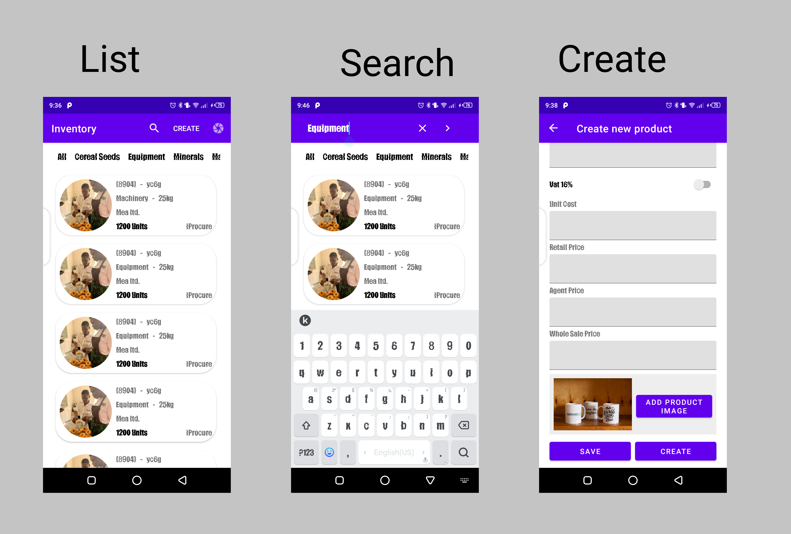

# Interview_Android_Test_App

## [Live App](https://appetize.io/app/yrrq64xw7y84gn159k1xb98tr4) - Take the app for a live spin here.

## About
- A simple MVVM project designed to be have low coupling with some degree of cohesion.
- This project is created with code re-usability, a screaming architecture, some solid principles like
single responsibility and dependency injection mind.
- The project domain has been modeled from the given exercise ui, a file called Development Tasks.doc
in the project file structure.
- However small it is, with time, it has the potential to be an over engineered application (For
good sleep), meaning CLEAN ARCHITECTURE.
- On top of that, you can easily plug in the network layer, implement cache and have the app running
 in no time.
- More importantly, the project also leverages some of kotlin's more exciting features, like the use
 of extension functions, sealed classes, lambdas functions, coroutines, and so on.

## Built Using 🛠
- [Kotlin](https://kotlinlang.org/) - First class and official programming language for Android
development.
- [ViewBinding](https://developer.android.com/topic/libraries/view-binding) - Generates a binding
  class for each XML layout file present in that module and allows you to more easily write code that
  interacts with views.
- [Room DB](https://square.github.io/retrofit/) - Used to locally store our data.
- [Dagger Hilt](https://dagger.dev/hilt/) - For dependency injection.
- [Data Binding](https://dagger.dev/hilt/) - Used especially to bind data to the recyclerview.
- [Material Design](https://dagger.dev/hilt/) - Core design principles used to design the application.
- [Navigation Component](https://dagger.dev/hilt/) - Navigation system through the app.
- [Android Studio](https://dagger.dev/hilt/) - Arctic fox 2020.3.1

## FEATURES
- List of all products.
- List of all categories.
- Create a product.
- Filter all products by category.
- Search a product by category.
- Add product image from the camera.

## TODO'S
- Implement the functionalities using a different widget like TabLayout and Viewpager.
- Add more tests.
- Fix the bug in the horizontal list.
- Search a product using other attributes like name etc [FEATURE].
- Clean dependencies in the app gradle file.
- Fix UI jank when create in the toolbar is clicked.
- Clean out all unused classes/ files.
- Add color to the clicked item in the horizontal recyclerview holder.
- Appropriately handle camera permissions.
- DRY the app a bit more.
- Add the todos as issues in the github repo.

## How to use this project
- Clone this repo into android studio.
- Build & Run the app.

## Click the image below to watch how it works.

## Contact
If you need any help, you can connect with me.

Visit:- [maku](https://www.linkedin.com/in/maku-mazakpe-700a3a165/)

